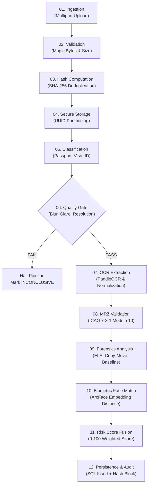

<div align="center">

# 🛡️ FIDSS — Fake Identity & Document Screening System
### Multi-Layered, Explainable Border Security & Document Forgery Detection Platform

[](https://sih.gov.in)
[](https://sih.gov.in)
[](https://github.com/dullamanojreddy/fidss)

<br/>

[](https://fastapi.tiangolo.com)
[](https://python.org)
[](https://reactjs.org)
[](https://vitejs.dev)
[](https://tailwindcss.com)
[](https://www.sqlalchemy.org)
[](https://www.mysql.com)
[](https://www.docker.com)
[](https://www.icao.int)
[](https://en.wikipedia.org/wiki/Cryptographic_hash_function)

<p align="center">
  <b>Designed for Border Checkpoints, Immigration Counters, and Law Enforcement</b><br/>
  An explainable, multi-stage identity verification pipeline fusing computer-vision forensics, OCR extraction, check-digit verification, biometric face matching, and an immutable cryptographic audit trail into an intuitive officer console.
</p>

[Key Features](#-key-features) • [System Architecture](#-system-architecture) • [12-Step Screening Pipeline](#-12-step-orchestration-pipeline) • [Tech Stack](#-technology-stack) • [Quick Start](#-quick-start) • [Live Demo SOP](#-demonstration-sop--jury-walkthrough) • [API Contracts](#-api-specification)

</div>

---

## 📌 Executive Summary & Problem Context

* **Problem Statement ID:** 26188 (Smart India Hackathon 2026)
* **Theme:** Blockchain & Cybersecurity / Smart Border Security
* **Operational Setting:** High-throughput international airports, land border checkpoints, seaport immigration counters, and consular visa processing desks.

Border control points handle thousands of travelers hourly under extreme time pressure (averaging 15–30 seconds per inspection). Conventional manual inspection is prone to cognitive fatigue and cannot reliably detect modern sophisticated forgery techniques:
* **Micro-Altered DOB / Expiry**: Single-digit glyph modifications on passports and visas.
* **Photo Substitution**: High-quality physical or digital headshot replacement.
* **Copy-Move & Digital Splices**: Cloned background patterns, stamps, or official seals.
* **Compression Discrepancies**: Inconsistent Error Level Analysis (ELA) and JPEG quantization artifacts.
* **Synthetic & Duplicate Identities**: Recycled passport numbers across distinct personas.
* **Watchlist Impersonation**: High-risk individuals attempting entry under similar identity variants.

### 💡 The FIDSS Solution
**FIDSS** transforms border document inspection from a subjective, fatigue-prone task into an **explainable, evidence-backed decision support system**. 
* **Zero Black-Box Decisions**: FIDSS never acts as an autonomous black-box judge. Every anomaly is captured as a normalized `EvidenceItem` with bounding box coordinates, confidence scores, and forensic metrics.
* **Human-in-the-Loop Cockpit**: Border officers receive clear visual overlays, risk gauge meters, and structured checklists before making an informed `ACCEPT`, `REJECT`, `ESCALATE`, or `REQUEST_RECAPTURE` decision.
* **Mathematical Audit Trail**: Every screening event and officer review is hashed into a tamper-evident **SHA-256 hash chain**, mathematically guaranteeing that inspection logs cannot be retroactively altered or erased.

---

## ✨ Key Features

| Feature | Description |
| :--- | :--- |
| 🔍 **Multi-Layered Forensics** | Combines Error Level Analysis (ELA), Copy-Move detection, noise variance mapping, and text baseline alignment to expose document tampering. |
| 🔤 **ICAO 9303 MRZ Engine** | Automatically parses Machine Readable Zones (Type 1, 2, 3), calculates modulo 10 (7-3-1 weight) checksums, and cross-checks against visual OCR. |
| 👤 **Biometric Face Verification** | Detects primary faces using SCRFD and matches deep 512-D embeddings via ArcFace against traveler live selfies. |
| ⛓️ **Tamper-Evident SHA-256 Audit Trail** | Chained canonical event ledger ($H_n = \text{SHA256}(H_{n-1} + \text{Payload} + \text{Timestamp})$) with 1-click cryptographic integrity verification and live tamper simulation. |
| 🛡️ **Fail-Safe Invariants** | A module crash, timeout, or poor image quality **never** produces a silent `CLEAR`. Incomplete or failing checks escalate to `REVIEW_RECOMMENDED` or `INCONCLUSIVE`. |
| 🗄️ **100% Database-Driven** | Powered by SQLAlchemy 2.0 and MySQL 8 (with zero-config SQLite support for development). Zero hardcoded mock arrays. |
| 🖥️ **Modern Border Officer Console** | Responsive React 18 + TailwindCSS interface with document viewer, OCR text bounding boxes, risk gauge, findings drawers, and audit explorer. |
| 👮 **Role-Based Access Control (RBAC)** | Strict server-side RBAC with JWT authentication distinguishing `OFFICER` (screening, reviewing) and `ADMIN` (threshold tuning, model registry, audit monitoring). |

---

## 🏗️ System Architecture

FIDSS is engineered as a clean, modular monolith with explicit contract boundaries between analytical forensic engines and the core platform.

```
                                 +-----------------------------------------+
                                 |         React 18 + Vite Frontend        |
                                 |      (TailwindCSS + Lucide Icons)       |
                                 +--------------------+--------------------+
                                                      |
                                                      | REST + JWT Bearer
                                                      v
                                 +-----------------------------------------+
                                 |             FastAPI Backend             |
                                 |       (Auth, RBAC, REST Endpoints)      |
                                 +--------------------+--------------------+
                                                      |
                                                      v
                                 +-----------------------------------------+
                                 |          Screening Orchestrator         |
                                 |         (12-Step Pipeline Engine)       |
                                 +--------------------+--------------------+
                                                      |
                      +-------------------------------+-------------------------------+
                      |                               |                               |
          +-----------v-----------+       +-----------v-----------+       +-----------v-----------+
          | P1: OCR & Quality     |       | P2: MRZ & Validation  |       | P3: Forensics & CV    |
          | - Usability Gate      |       | - ICAO 9303 Checksum  |       | - ELA Compression     |
          | - PaddleOCR PP-OCRv4  |       | - OCR Cross-Match     |       | - Copy-Move Detection |
          | - Text Bounding Boxes |       | - Watchlist Query     |       | - Noise Variance      |
          +-----------+-----------+       +-----------+-----------+       +-----------+-----------+
                      |                               |                               |
                      +-------------------------------+-------------------------------+
                                                      |
                                         +------------v------------+
                                         | P4: Face & Risk Fusion  |
                                         | - SCRFD + ArcFace Match |
                                         | - Weighted Risk Engine  |
                                         +------------+------------+
                                                      |
                              +-----------------------+-----------------------+
                              |                                               |
                  +-----------v-----------+                       +-----------v-----------+
                  |  Relational Database  |                       |  SHA-256 Audit Chain  |
                  | (SQLAlchemy / MySQL 8)|                       | (Tamper-Evident Log)  |
                  +-----------------------+                       +-----------------------+
```

---

## 🔄 12-Step Orchestration Pipeline

Every identity document submitted to FIDSS undergoes an atomic, 12-step sequential screening pipeline:



1. **`01_RECEIVE_UPLOAD`**: Ingests primary document image and optional live selfie from authenticated officer.
2. **`02_VALIDATE_FILE`**: Inspects binary magic bytes (`image/jpeg`, `image/png`) and enforces file size constraints ($\le 10\text{MB}$).
3. **`03_COMPUTE_SHA256`**: Computes document SHA-256 hash for deduplication and cryptographic provenance.
4. **`04_STORE_DOCUMENT`**: Writes to isolated storage using sanitized UUID filenames to neutralize path-traversal exploits.
5. **`05_DETERMINE_DOC_TYPE`**: Identifies document type (`passport`, `visa`, `national_id`, `driving_license`).
6. **`06_IMAGE_QUALITY_CHECK`**: Runs P1 Quality Gate (Laplacian blur variance, luminance, contrast, edge resolution). If unreadable, halts immediately to prevent false alarms.
7. **`07_OCR_EXTRACTION`**: Runs OCR engine to extract textual tokens, normalize semantic fields (Name, Document #, DOB, Expiry), and extract bounding boxes.
8. **`08_VALIDATION_MRZ`**: Validates ICAO 9303 compliance, calculates Modulo 10 (7-3-1) check digits, cross-verifies visual OCR against MRZ, and queries synthetic watchlists.
9. **`09_TAMPERING_FORENSICS`**: Computes Error Level Analysis (ELA), performs copy-move feature matching, checks noise inconsistencies, and detects altered fonts.
10. **`10_FACE_VERIFICATION`**: Extracts document portrait and matches deep facial embeddings against traveler selfie using SCRFD + ArcFace.
11. **`11_FUSION_RISK_AGGREGATION`**: Aggregates all atomic `EvidenceItem` findings into a unified 0–100 risk score and screening level:
    * `CLEAR` (0 – 29)
    * `REVIEW_RECOMMENDED` (30 – 59)
    * `ENHANCED_REVIEW_RECOMMENDED` (60 – 84)
    * `INCONCLUSIVE` (Quality Failure / Incomplete Data)
12. **`12_PERSISTENCE_AUDIT_LOG`**: Atomically commits records to the relational database and appends a cryptographically chained block to the audit ledger.

---

## 👥 Module Ownership & Engineering Boundaries

To enable parallel hackathon development without merge conflicts, the codebase strictly enforces ownership boundaries via frozen Pydantic schemas in `backend/app/schemas/`:

```
backend/
├── app/
│   ├── modules/
│   │   ├── ocr/            --> [Person 1] OCR Extraction & Text Preprocessing
│   │   ├── quality/        --> [Person 1] Image Quality Gate (Blur, Brightness, Glare)
│   │   ├── validation/     --> [Person 2] ICAO 9303 MRZ Engine & Rules Validation
│   │   ├── tampering/      --> [Person 3] Computer Vision Forensics (ELA, Copy-Move)
│   │   ├── face/           --> [Person 4] SCRFD Face Detection & ArcFace Verification
│   │   └── fusion/         --> [Person 4] Evidence Aggregation & Risk Scoring
│   ├── core/               --> [Person 5] Config, Security, JWT, RBAC Dependencies
│   ├── db/                 --> [Person 5] Database Session, Engine & Seeding
│   ├── models/             --> [Person 5] SQLAlchemy Relational Models
│   ├── schemas/            --> [Person 5] Shared Frozen Pydantic Data Contracts
│   ├── services/           --> [Person 5] Orchestrator, Storage, & SHA-256 Audit Chain
│   ├── providers/          --> [Person 5] Watchlist & Blockchain Anchor Abstractions
│   └── api/                --> [Person 5] FastAPI REST Controllers
```

* **Module Dispatcher Pattern (`services/orchestrator.py`)**: Person 5 communicates with analytical modules through `ModuleDispatcher`. If an ML model is undergoing training or missing libraries, the dispatcher falls back to a contract-conforming stub, ensuring uninterrupted platform stability.
* **Failure Isolation Guarantee**: Module errors or crashes are captured as `ModuleResult.status = FAILED` and escalate screening severity—the system **never** silently defaults to `CLEAR`.

---

## ⛓️ Cryptographic Audit Trail & Blockchain Readiness

Border security audit logs must be resilient against insider tampering or unauthorized record deletions. FIDSS implements an immutable **SHA-256 Previous-Hash Chain**:

$$\text{Block Hash}_n = \text{SHA-256}\Big(\text{Block Hash}_{n-1} \parallel \text{Canonical JSON}(\text{Event Payload}_n) \parallel \text{Timestamp}_n\Big)$$

```text
+-----------------------+     +-----------------------+     +-----------------------+
| Block #1 (GENESIS)    |     | Block #2 (SCREENING)  |     | Block #3 (REVIEW)     |
| Hash: 0000a8f1...     |     | Hash: b4e29c11...     |     | Hash: d89a77f0...     |
| Prev: 000000000000000 |<----+ Prev: 0000a8f1...     |<----+ Prev: b4e29c11...     |
| Event: SYSTEM_INIT    |     | Event: SCREENING_DONE |     | Event: OFFICER_ACCEPT |
+-----------------------+     +-----------------------+     +-----------------------+
```

### 🔬 Mathematical Verification & Tamper Simulation
* **Instant Verification (`POST /api/audit/{id}/verify`)**: Traverses the chain from Genesis to Head. If even a single byte or timestamp was modified in the database, hash recalculation fails immediately with `AUDIT_INTEGRITY_FAILURE`.
* **Live Demonstration Mode (`POST /api/audit/tamper-demo`)**: Demonstrates forensic efficacy for evaluators by simulating an unauthorized SQL row alteration, showing an immediate Red integrity alert on the UI.
* **Blockchain Anchor Ready**: Implements the `AuditAnchorProvider` interface to anchor block merkle roots to enterprise ledgers (e.g. Hyperledger Fabric, Polygon, Ethereum) without altering application logic.

---

## 🛠️ Technology Stack

| Layer | Component | Version / Technology | Key Purpose |
| :--- | :--- | :--- | :--- |
| **Frontend** | Framework | React 18.2 + Vite 5.1 | High-speed SPA with fast hot-module replacement |
| | Styling | TailwindCSS 3.4 | Custom border security cockpit styling |
| | Icons | Lucide React | Clean, intuitive operational icons |
| | Routing & HTTP | React Router 6 + Axios | Client-side routing with JWT interceptors |
| **Backend** | Framework | FastAPI (Python 3.11+) | Asynchronous high-throughput REST API |
| | Data Contracts | Pydantic v2 | Immutable data validation and serialization |
| | ORM | SQLAlchemy 2.0 | Explicit relational modeling with foreign keys |
| | Database | MySQL 8.0 / SQLite 3 | Production relational storage / zero-setup dev mode |
| | Authentication | PyJWT + Passlib (Bcrypt) | Stateless JWT tokens and salted password hashes |
| **Forensics** | OCR Engine | PaddleOCR PP-OCRv4 | Multi-lingual text and MRZ extraction |
| | Computer Vision | OpenCV, Scikit-Image, PIL | Image quality, ELA compression, noise variance |
| | Biometrics | InsightFace (SCRFD + ArcFace) | 512-D deep facial representation & matching |
| **DevOps** | Containerization | Docker & Docker Compose | Multi-container stack (DB + Backend + Frontend) |
| | Testing | Pytest & HTTPX | Automated unit, contract, and integration testing |

---

## 🚀 Quick Start

### Prerequisites
* **Python**: 3.11+ (Tested on Python 3.11, 3.12, 3.14)
* **Node.js**: v18+ (Tested on Node.js v20, v24)
* **Git**: Installed and configured

---

### Option A: Complete Stack via Docker Compose (Recommended)

To launch the full production environment including MySQL 8, FastAPI backend, and React frontend:

```bash
# Clone repository
git clone https://github.com/dullamanojreddy/fidss.git
cd sih

# Copy environment variables
cp .env.example .env

# Build and start all containers
docker compose up --build
```

* **Frontend Console**: [http://localhost:5173](http://localhost:5173)
* **FastAPI Interactive Docs**: [http://localhost:8000/docs](http://localhost:8000/docs)
* **Backend Health Check**: [http://localhost:8000/health](http://localhost:8000/health)

---

### Option B: Local Development Setup

#### 1. Backend Setup

```bash
# Navigate to backend directory
cd backend

# Create and activate virtual environment
# Windows:
python -m venv .venv
.venv\Scripts\activate

# Linux / macOS:
# python3 -m venv .venv
# source .venv/bin/activate

# Install dependencies
pip install -r requirements.txt

# Run automated tests
python -m pytest tests/ -v

# Launch backend server (with auto-reload)
python -m uvicorn app.main:app --host 0.0.0.0 --port 8000 --reload
```

#### 2. Frontend Setup

```bash
# Open a new terminal and navigate to frontend
cd frontend

# Install node packages
npm install

# Start Vite development server
npm run dev
```

* Open your browser and navigate to **`http://localhost:5173`**.

---

## 🔑 Default Credentials & Role Profiles

Pre-configured in `.env` for rapid demonstration:

| Role | Username | Password | Permissions |
| :--- | :--- | :--- | :--- |
| **Border Officer** | `arjun` | `OfficerArjun2026!` | Ingest screenings, review evidence, inspect audit logs, submit verdicts |
| **Administrator** | `admin` | `AdminSecure2026!` | All officer capabilities + system settings, threshold tuning, model registry |

---

## 🎬 Demonstration SOP & Jury Walkthrough

Follow this standard 5-step operational flow during evaluations:

```text
  [ Step 1: Login ] ──> [ Step 2: Dashboard ] ──> [ Step 3: Screening Console ]
                                                               |
  [ Step 5: Audit & Tamper Demo ] <── [ Step 4: Officer Review ]
```

1. **Sign In**:
   * Log in with username `arjun` and password `OfficerArjun2026!`.
2. **Dashboard Overview**:
   * Observe checkpoint statistics: Total Screenings, Verified Clear, Flagged Reviews, and Average Latency.
3. **Screening Console Inspection**:
   * Select active screening session (`SID-2026-05-21-00124`).
   * Observe the 7-step pipeline indicator: `Upload` $\to$ `OCR` $\to$ `MRZ` $\to$ `Tampering` $\to$ `Face` $\to$ `Risk Fusion` $\to$ `Completed`.
   * Inspect the **Risk Score Gauge** (18 / 100, `CLEAR`).
   * Review **Extracted Document Information** (Holder Name, Passport #, Nationality, DOB, Expiry, MRZ Checksum Status).
   * Review individual **Module Cards** (OCR confidence, MRZ 7-3-1 validation, ELA tampering results, face match score).
   * Test **"New Screening"**: Upload any passport/ID image to run the live 12-step pipeline.
4. **Officer Review Workflow**:
   * Click **"Proceed to Review"**.
   * Select decision: `ACCEPT` (or `REJECT`, `ESCALATE`, `REQUEST_RECAPTURE`).
   * Choose reason code and provide justification notes.
   * Submit review $\to$ notice the record is persisted and an audited event is created.
5. **Tamper-Evident Cryptographic Audit Demo**:
   * Navigate to **Audit Trail** from the top navigation bar.
   * Click **"Verify Audit Integrity"** $\to$ observe the bright green **VERIFIED** banner confirming all SHA-256 chain links match.
   * Click **"Simulate Row Tampering (Demo)"** $\to$ click **"Verify Audit Integrity"** again.
   * Observe the immediate red **AUDIT INTEGRITY FAILURE** alert, demonstrating that database modifications cannot escape cryptographic detection.

---

## 📡 API Specification

All endpoints return JSON and use standard HTTP status codes. Authenticated endpoints require `Authorization: Bearer <JWT_TOKEN>`.

### Authentication
* `POST /api/auth/login`: Authenticate officer/admin and receive JWT access token.
* `GET /api/auth/me`: Retrieve profile of currently authenticated user.

### Screening Operations
* `POST /api/screenings`: Upload document image (and optional selfie) to initiate 12-step screening.
* `GET /api/screenings`: List past screenings with pagination, search, and severity filters.
* `GET /api/screenings/{id}`: Fetch complete screening details, module results, and extracted fields.
* `GET /api/screenings/{id}/evidence`: Fetch normalized list of all `EvidenceItem` findings.
* `GET /api/documents/{id}/file`: Securely stream stored document image for console preview.

### Officer Reviews
* `POST /api/screenings/{id}/review`: Record human-in-the-loop decision (`ACCEPT`, `REJECT`, `ESCALATE`, `REQUEST_RECAPTURE`).

### Cryptographic Audit
* `GET /api/audit/logs`: Retrieve chronological hash-chained audit blocks.
* `POST /api/audit/{screening_id}/verify`: Verify unbroken cryptographic chain integrity.
* `POST /api/audit/tamper-demo`: Controlled simulation of database tampering for live demo.

### Dashboard & Administration
* `GET /api/dashboard`: Fetch checkpoint throughput, risk distribution, and module latency metrics.
* `GET /api/settings`: Read active system thresholds (Admin/Officer).
* `PUT /api/settings`: Update risk weights and verification thresholds (Admin only, audited).
* `GET /api/watchlist/search`: Search synthetic border watchlist records.

---

## 📁 Repository Structure

```
fidss/
├── .env.example                 # Template for environment configuration
├── docker-compose.yml           # Production-ready multi-container orchestration
├── README.md                    # Project documentation
├── AGENT_RULES.md               # Team engineering rules and ownership standards
├── docs/                        # Technical documentation & design specifications
│   ├── PROJECT_CONTEXT.md       # Master project context & architecture decisions
│   ├── architecture.md          # Detailed architecture & pipeline breakdown
│   ├── api-contracts.md         # Complete REST API specification
│   ├── database.md              # Relational schema design & indexing strategy
│   ├── module-contracts.md      # Pydantic schemas for Persons 1–4
│   ├── security.md              # Security hardening, RBAC, and crypto specifications
│   ├── sop.md                   # Standard Operating Procedure for demonstrations
│   └── ui-reference/            # UI specifications and layout references
├── backend/                     # FastAPI Backend Application
│   ├── Dockerfile               # Production multi-stage Docker build
│   ├── requirements.txt         # Python dependencies
│   ├── app/
│   │   ├── main.py              # Application factory & router configuration
│   │   ├── api/                 # REST controllers (auth, screenings, audit, etc.)
│   │   ├── core/                # App config, security, JWT helpers, logging
│   │   ├── db/                  # Database engine, session maker, seed script
│   │   ├── models/              # SQLAlchemy relational models
│   │   ├── schemas/             # Pydantic contract schemas (DocumentContext, EvidenceItem)
│   │   ├── services/            # Orchestrator pipeline, storage, & SHA-256 audit chain
│   │   ├── providers/           # Watchlist & blockchain anchor providers
│   │   └── modules/             # Analytical forensic engines (OCR, Quality, MRZ, Tamper, Face)
│   └── tests/                   # Automated test suite (unit, contract, integration)
└── frontend/                    # React 18 + Vite Frontend Application
    ├── Dockerfile               # Nginx-based production Docker build
    ├── package.json             # Frontend dependencies and build scripts
    ├── tailwind.config.js       # Custom design system configuration
    ├── vite.config.js           # Vite build and proxy settings
    └── src/
        ├── App.jsx              # App layout, navigation, and protected routes
        ├── api/                 # Axios HTTP client with JWT interceptors
        ├── context/             # Authentication & session context
        ├── components/          # Reusable UI components (modals, badges, charts)
        └── pages/               # Screenings, Console, Reviews, Audit Trail, Dashboard
```

---

## 🔒 Security Hardening

* **MIME Magic-Byte Verification**: Rejects masqueraded file payloads before they touch processing engines.
* **Path Traversal Defense**: Files are stored with cryptographically random UUID filenames; user-supplied paths are discarded.
* **Strict Memory Limits**: Hard upload cap at 10MB to protect against decompression and memory exhaustion attacks.
* **Fail-Closed Architecture**: Missing components, expired credentials, or unreadable inputs automatically fail closed (`INCONCLUSIVE` or `REVIEW_RECOMMENDED`), preventing unauthorized entries.
* **Cryptographic Nonce & Hash Chaining**: Every audit entry is cryptographically anchored to its predecessor, mitigating log erasure.

---

## 🔮 Roadmap & Future Horizons

- [ ] **Hardware Passport Scanner Integration**: Direct USB/NFC integration with 3M/Gemalto ICAO 9303 hardware scanners.
- [ ] **RFID Chip Verification**: Passive & Active Authentication (PA/AA) for e-Passports using BAC/PACE protocols.
- [ ] **Enterprise Distributed Ledger Anchoring**: Production connector to Hyperledger Fabric for cross-border checkpoint federated audit consensus.
- [ ] **Interpol & National Database Connectors**: Direct gRPC connectors to official immigration and law enforcement watchlists.
- [ ] **Edge Inference Optimization**: TensorRT and ONNX runtime quantization for offline deployment on ruggedized border tablets.

---

## 📜 License & Acknowledgments

* **License**: Open-source under the [MIT License](LICENSE).
* **Organizers**: Developed for the **Smart India Hackathon (SIH 2026)**.
* **Standards Reference**: Built in strict adherence to **ICAO Document 9303** (Machine Readable Travel Documents).

<div align="center">
  <sub>Engineered with precision for Smart Border Security and Document Integrity.</sub>
</div>
